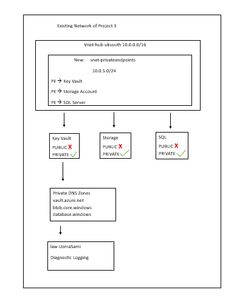

# 🔐 Azure Private Endpoints Security

## Overview
Complete Private Endpoint implementation securing 
Azure PaaS services from public internet access.
Built on existing Hub & Spoke network architecture.

*Engineer:* Uzma Sami 
*Region:* UK South  
*Architecture:* Hub & Spoke with dedicated PE subnet

## Architecture


##  Services Secured
| Service | Public Access | Private Endpoint | DNS Zone |
|---------|--------------|-----------------|---------|
| Azure Key Vault | ❌ Disabled | ✅ Active | privatelink.vaultcore.azure.net |
| Storage Account | ❌ Disabled | ✅ Active | privatelink.blob.core.windows.net |
| SQL Server | ❌ Disabled | ✅ Active | privatelink.database.windows.net |

## 🌐 Network Design
- *Hub VNet:* 10.0.0.0/16 (PE subnet: 10.0.5.0/24)
- *Spoke1 VNet:* 10.1.0.0/16 (Workloads)
- *Spoke2 VNet:* 10.2.0.0/16 (Management)
- *DNS:* Private zones linked to all VNets
## Security Results
-3 Private Endpoints deployed
- 4 Private DNS Zones configured
- Zero public internet exposure
- All logs-->centralized Log Analytics
- TLS 1.2 enforced on all services
- SQL credentials secured in Key Vault

## Technologies Used
- Azure Private Endpoints
- Azure Private DNS Zones
- Azure Key Vault
- Azure Storage Account
- Azure SQL Database
- Log Analytics Workspace
- PowerShell/ Az Module
## Author
## Uzma Shabbir Azure Security Engineer | AZ-104 | AZ-500
## Deployment Order
```powershell
# Phase 1: Network prep
.\01-network-prep\add-pe-subnet.ps1
.\01-network-prep\create-private-dns-zones.ps1

# Phase 2: Key Vault
.\02-key-vault-private\create-key-vault.ps1
.\02-key-vault-private\create-pe-keyvault.ps1

# Phase 3: Storage
.\03-storage-private\create-storage-secure.ps1
.\03-storage-private\create-pe-storage.ps1

# Phase 4: SQL
.\04-sql-private\create-sql-server.ps1
.\04-sql-private\create-pe-sql.ps1

# Phase 5: Verify
.\05-dns-verification\verify-dns-resolution.ps1

# Phase 6: Diagnostics
.\06-diagnostics\enable-pe-diagnostics.ps1

# Phase 7: Report
.\07-compliance-report\generate-pe-report.ps1


